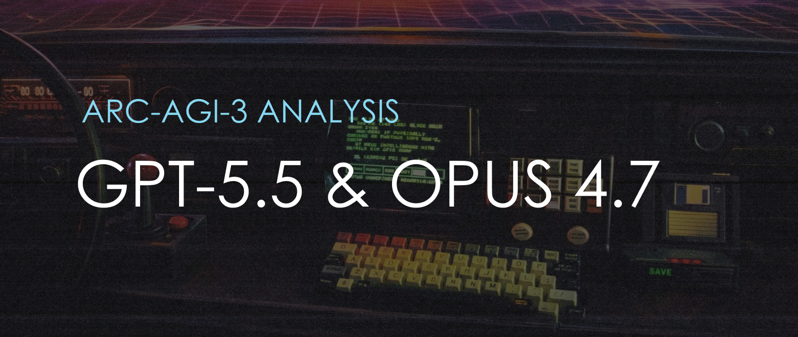
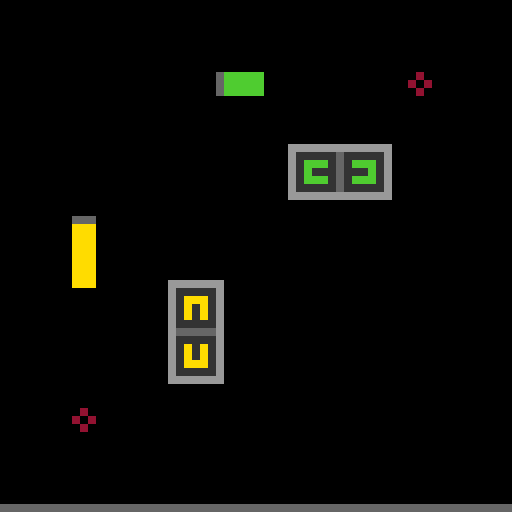
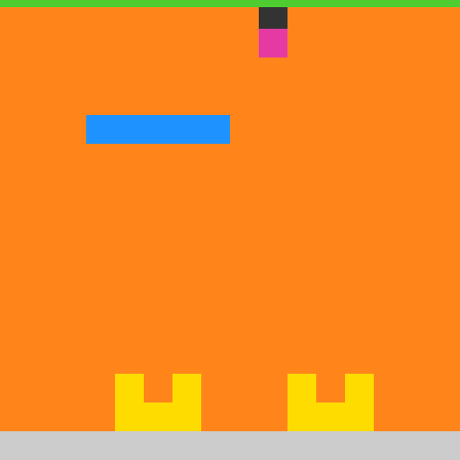
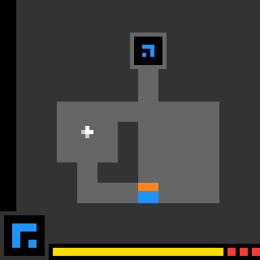
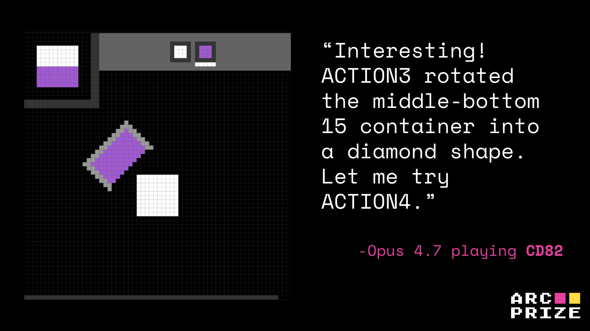
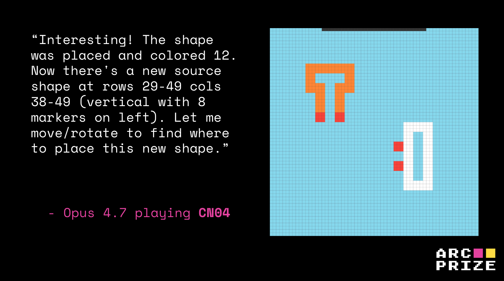
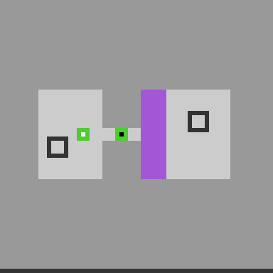
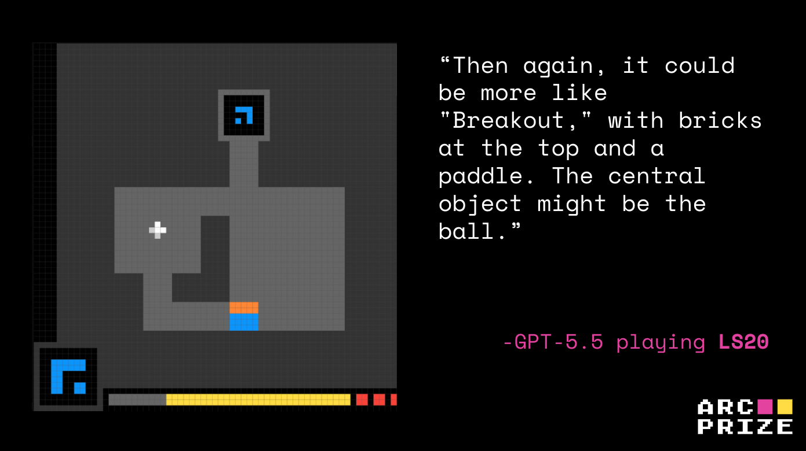
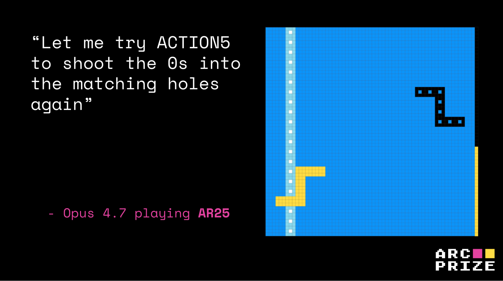

## 3줄 요약

1. ARC Prize의 Greg Kamradt가 GPT-5.5(0.43%)와 Opus 4.7(0.18%)을 ARC-AGI-3 벤치마크로 평가하고, 점수보다 *어떻게* 실패하는가에 초점을 맞춘 질적 분석을 공개했다.
2. 세 가지 핵심 실패 모드를 식별했다: 국소 효과만 학습하고 세계 모델을 못 만드는 것, 훈련 데이터의 기존 게임에 앵커링하는 것, 우연한 성공이 오류 이론을 강화하는 것.
3. 두 모델의 결정적 차이는 압축 전략이다. Opus는 자신감 있게 틀리고, GPT-5.5는 압축 자체를 못 한다.

## ARC-AGI-3이란

ARC-AGI-3은 135개의 완전히 새로운 환경으로 구성된 벤치마크다. 각 환경은 문화적 지식을 의도적으로 배제하여 순수한 추상적 추론 능력만을 분리 측정한다. 테스트하는 능력은 다섯 가지다:

- 미지의 인터페이스 탐색
- 희소한 피드백에서 규칙 추론
- 가설 형성과 검증
- 잘못된 가정에서의 회복
- 레벨 간 지속적 학습

## 벤치마크 점수

반비공개 데이터셋 기준 결과:

- **GPT-5.5**: 0.43%
- **Opus 4.7**: 0.18%

절대 점수는 극히 낮다. 그러나 이 연구의 핵심은 점수가 아니라 *실패의 양상*이다. 점수가 크게 다른 두 모델이 완전히 다른 이유로 실패할 수 있다는 것, 그래서 총점만으로는 실세계 배포 적합성을 판단할 수 없다는 것이 중심 논지다.

## 세 가지 핵심 실패 모드

### 1. 국소 효과만 학습, 세계 모델 구축 실패

모델이 개별 행동의 효과는 관찰하지만, 관찰을 일반화 가능한 규칙으로 통합하지 못한다.

cd82 환경에서 Opus는 "ACTION3이 컨테이너를 회전시킨다"와 "ACTION5가 페인트를 분사한다"를 각각 발견했다. 그러나 이 두 관찰을 "버킷의 방향을 맞춘 뒤 페인트를 적용해서 목표를 재현한다"는 전체 전략으로 합성하지 못했다. 부분 관찰에서 전체 전략을 조립하는 능력이 결여되어 있다.

### 2. 훈련 데이터 앵커링: 잘못된 추상화 수준

낯선 역학을 만나면 표면적 시각 유사성만으로 테트리스, 프로거, 소코반, 브레이크아웃, 퐁 같은 기존 게임에 매핑한다.

> "국소적 시각 유사가 전체 게임플레이 이론이 되고, 모델은 잘못된 어포던스를 검증하느라 행동을 낭비한다."

이 앵커링이 일어나면 실제 규칙 탐색이 방해받는다. 모델이 새로운 환경을 *보면서도* 기존 지식의 렌즈로만 해석하는 것이다.

### 3. 레벨 클리어 ≠ 게임 이해

우연한 성공이 잘못된 작업 이론을 강화한다.

ka59에서 Opus는 "클릭하면 캐릭터가 텔레포트된다"라는 이론으로 레벨 1을 우연히 풀었다. 이 우연한 승리가 확신으로 굳어져 레벨 2에서 회복 불능에 빠졌다. 초기 성공이 학습의 적이 된 사례다.

## 모델 비교: 압축 전략의 차이

두 모델의 핵심적 차이는 관찰을 이론으로 압축하는 방식에 있다.

<strong>Opus 4.7</strong>은 단기 역학 발견에서 더 강하다. 관찰을 빠르게 일관된 이론으로 압축한다. 문제는 그 이론이 틀려도 자신감 있게 유지한다는 것이다. 거짓 불변량에 확신을 갖고 매달린다.

<strong>GPT-5.5</strong>는 더 넓은 가설을 생성하고 올바른 개념을 말로는 표현한다. 그러나 실행에 옮기지 못하고 우유부단하게 머문다. 압축 자체에 실패한다.

> "Opus는 관찰을 자신감 있지만 틀린 이론으로 압축했다. GPT-5.5는 압축 자체에 어려움을 겪었다."

## 실세계 에이전트에 대한 시사점

이 실패 모드는 자율 에이전트가 미지의 웹사이트, 내부 도구, 대시보드, 문서화되지 않은 API를 만났을 때 직면하는 도전과 정확히 동형이다. 사전 정의된 지침 없이 동적으로 적응해야 하는 상황에서, 모델의 추론 패턴이 통제된 환경 너머로 일반화될 것인지를 판단하는 데 이 분석이 의미를 갖는다.

## 가장 흥미로운 지점

Opus의 "과압축"과 GPT-5.5의 "미압축"이라는 대비가 인상적이다. 같은 벤치마크에서 비슷하게 낮은 점수를 받은 두 모델이, 완전히 다른 인지적 병목을 드러낸다. Opus는 *너무 빨리 닫고*, GPT-5.5는 *닫지 못한다*. 이것은 "어느 모델이 더 나은가"보다 "각 모델이 어떤 종류의 과제에서 위험한가"라는 질문이 더 유용하다는 것을 보여준다.

또한 "우연한 성공이 학습을 방해한다"는 발견은, 에이전트 시스템에서 단순한 성공/실패 피드백만으로 학습 루프를 설계하는 것이 왜 위험한지를 잘 보여준다.

## 출처

Greg Kamradt, ARC Prize (2026-05-01)
원문: <https://arcprize.org/blog/arc-agi-3-gpt-5-5-opus-4-7-analysis>
이미지 출처: ARC Prize, [CC BY 4.0](https://creativecommons.org/licenses/by/4.0/)
