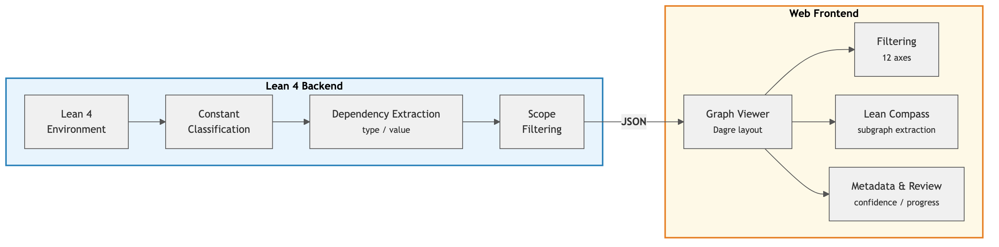
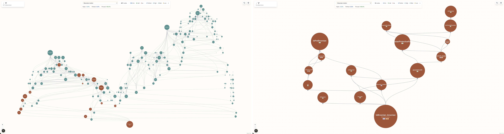
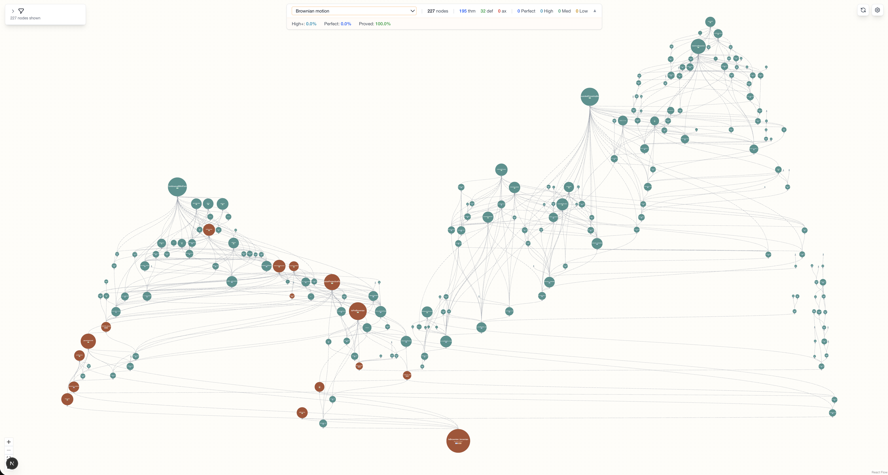

## 3줄 요약

1. Lean 4 형식화 프로젝트에서 AI가 생성한 증명이 타입 체크를 통과하더라도 의도한 수학을 표현하지 못하는 **의미적 환각(Semantic Hallucination)** 문제를 체계적으로 정의한 논문이다.
2. 타입 의존성과 값 의존성의 비대칭성을 이용해 인간이 리뷰해야 할 노드를 최대 99%까지 축소하는 **Lean Compass** 알고리즘을 제안하고, 수학적 건전성을 증명했다.
3. 6개 실제 Lean 프로젝트에서 평가한 결과, 리뷰 콘 내부의 정리/정의 비율이 축소율의 최선 예측자임을 밝혔다.

## 문제: 의미적 환각

AI 지원 수학 형식화에서 가장 미묘한 위험은 **논리적으로 올바르지만 의미적으로 틀린** 코드가 만들어지는 것이다. 타입 체커는 논리적 정합성만 검증하고, 명제가 의도한 수학적 의미를 담고 있는지는 판단하지 못한다.

대표적인 예시: Lean 4에서 `3/2 = 1.5`를 타입 명시 없이 작성하면 자연수로 추론되어 `3/2 = 1`이 통과한다. 형식적으로 완벽하지만 수학적으로 틀렸다.

논문이 분류한 의미적 환각의 5가지 패턴:

- **정의 불일치**: 정의가 의도한 수학적 개념과 다름
- **가정의 누락/과잉**: 전제 조건이 빠지거나 불필요하게 추가됨
- **목표 대체**: 증명할 대상 자체가 바뀜
- **양화사/스코프 오류**: 변수의 범위가 의도와 다름
- **타입 기본값 의미 전이**: 위의 `3/2` 사례처럼 타입 추론이 의미를 바꿈

## 핵심 관찰: 타입 의존성 vs 값 의존성

논문의 핵심 통찰은 의존 그래프의 엣지를 <strong>두 종류로 구분</strong>하는 것에서 시작한다.

- **타입 의존성**: 상수 B가 상수 A의 타입(명제, 정의) 구성에 등장하는 경우
- **값 의존성**: B가 A의 구현부(증명 항, 계산 본체)에만 등장하는 경우

여기서 결정적 비대칭이 발생한다:

> 정리 증명의 값 의존성은 타입 체크가 이미 보장하므로 가지치기해도 안전하다. 그러나 정의의 값 의존성은 계산적 내용을 담고 있어 반드시 보존해야 한다.

이 구분을 소스 종류(정리/정의) x 의존 위치(타입/값) x 대상 종류(정리/정의)의 3축으로 확장하면 8종의 엣지 분류가 나온다. 이 중 "소스=정리, 위치=값"인 엣지 2종만 가지치기하면 된다.

## Lean Atlas 시스템 아키텍처

*Figure 2. Lean 4 백엔드가 의존성을 추출\~분류하고, Next.js/React Flow 프론트엔드가 인터랙티브 시각화를 제공한다.*

**백엔드 (Lean 4):**
- 프로젝트의 모든 상수(정리, 정의, 귀납형, 구조체, 약칭, 공리)를 추출
- 의존성을 8종으로 분류
- Lake 빌드 시스템과 통합된 CLI로 JSON 출력

**프론트엔드 (Next.js / React Flow):**
- 12축 독립 필터링(종류, 신뢰도, sorry 상태, 엣지 종류 등)
- 선택한 정리의 계층적 의존 그래프 시각화
- 팀 기반 검증 추적 및 신뢰도 주석

## Lean Compass 알고리즘

Lean Compass는 대상 정리 집합이 주어졌을 때, 의미적 리뷰가 필요한 <strong>최소 노드 집합</strong>을 자동으로 추출한다.

1. 6가지 선언 종류를 3범주(정리, 정의, 공리)로 집약
2. 엣지를 8종으로 분류
3. **가지치기**: 소스=정리 & 위치=값인 엣지(#3, #4) 제거
4. 가지치기된 그래프에서 BFS로 도달 가능 노드 계산
5. 공리는 항상 포함

**건전성 보장**: 도달 가능 집합 R과 공리 집합 A의 모든 노드가 의미적으로 정확하고, 신뢰 기반(Lean 표준 라이브러리, Mathlib)이 올바르면, 대상 정리의 명제가 의도한 수학적 내용을 충실히 표현한다.

## 평가 결과

6개 실제 Lean 4 프로젝트에서 총 38개 정리를 대상으로 평가했다.

**증명 지배 프로젝트 (높은 축소율):**
- <strong>PrimeNumberTheoremAnd</strong>: 99.1\~99.7% 축소
- <strong>Carleson</strong>: 88.1\~99.7% 축소 (평균 96.2%)
- <strong>Brownian Motion</strong>: 89.1\~99.0% 축소 (평균 94.4%)

**혼합 프로젝트 (중간 축소율):**
- <strong>FLT</strong> (6개 마일스톤 정리): 30.4\~96.8% 축소 (평균 59.8%)
- <strong>PhysLib</strong> (이론물리, 5개 정리): 37.0\~96.0% 축소 (평균 69.0%)

**정의 지배 프로젝트 (낮은 축소율):**
- <strong>XMSS Encoding Scheme</strong>: 11.1\~51.1% 축소 (평균 27.3%)

## 가장 직관적인 사례: IsBrownian 정리

*Figure 3. Brownian Motion 프로젝트의 IsBrownian_brownian 정리. 227개 노드에서 14개로 93.8% 축소.*

*Figure 1. Lean Atlas 웹 뷰어에서 본 IsBrownian_brownian 정리의 리뷰 콘. 청록색은 가지치기된 노드, 주황색은 리뷰 필요 노드.*

227개 의존 노드 중 인간이 의미를 확인해야 할 것은 14개뿐이었다. 나머지 213개는 증명 수준 의존성이라 타입 체크만으로 충분했다.

## 가장 흥미로운 지점

이 논문의 핵심 메시지는 **"의미적 환각은 탐지 알고리즘이 아니라 워크플로우 구조로 대응해야 한다"** 는 것이다.

타입 시스템이라는 이미 존재하는 구조적 성질을 활용하여, 인간 리뷰의 범위를 수학적 근거 위에서 축소한다는 발상이 깔끔하다. 특히 "정리 증명의 값 의존성은 타입 체크가 보장하므로 가지치기 가능"이라는 관찰은, 증명 보조기의 타입 이론적 성질을 실용적 도구 설계에 직결시킨 좋은 사례다.

프로젝트의 "정리/정의 비율"이 축소율의 최선 예측자라는 발견도 실무적으로 유용하다. 형식화 프로젝트 기획 단계에서 Lean Compass의 효과를 미리 추정할 수 있다는 뜻이기 때문이다.

## 출처

Banri Yanahama (Nyx Foundation), Akiyoshi Sannai (Kyoto University, National Institute of Informatics). 2026년 3월 16일.
원문: <https://arxiv.org/html/2604.16347v1>
코드: <https://github.com/NyxFoundation/lean-atlas>
라이선스: CC BY 4.0

*Figure 1\~3은 원 논문에서 CC BY 4.0 라이선스에 따라 인용.*
